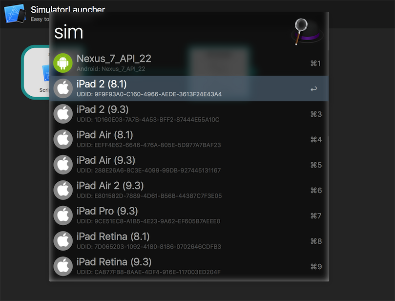
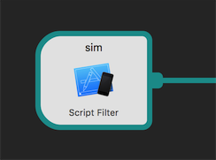
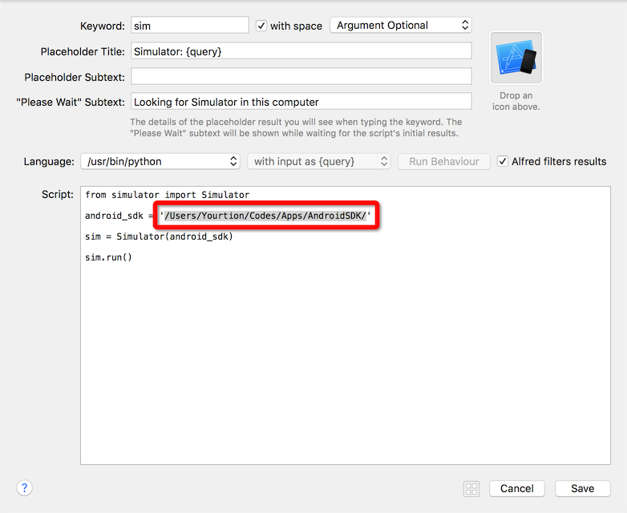

# Alfred_SimulatorLauncher

Easy to launch simulator form Alfred. 

快速启动模拟器

## Config Android SDK path

you may need to set Andrdoid SDK path from `{ANDROID_HOME}` to you path.

Double click to set.

My path is `/Users/Yourtion/Codes/Apps/AndroidSDK/`

